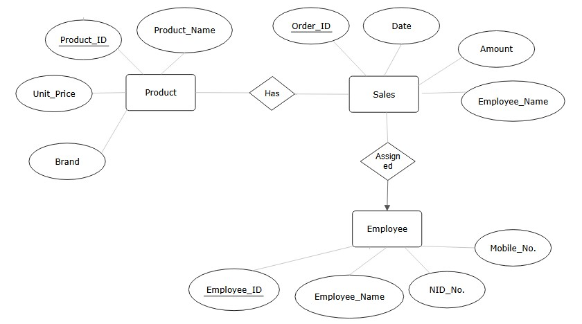
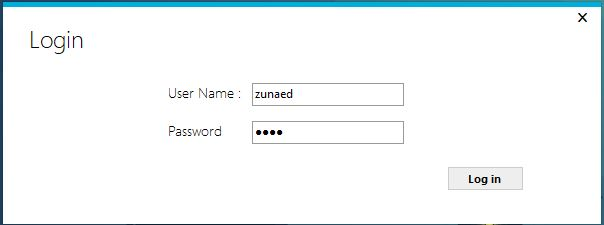
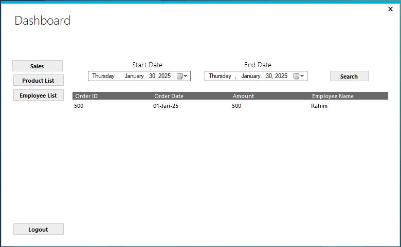
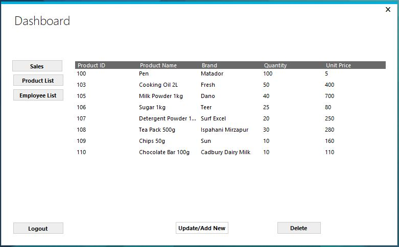
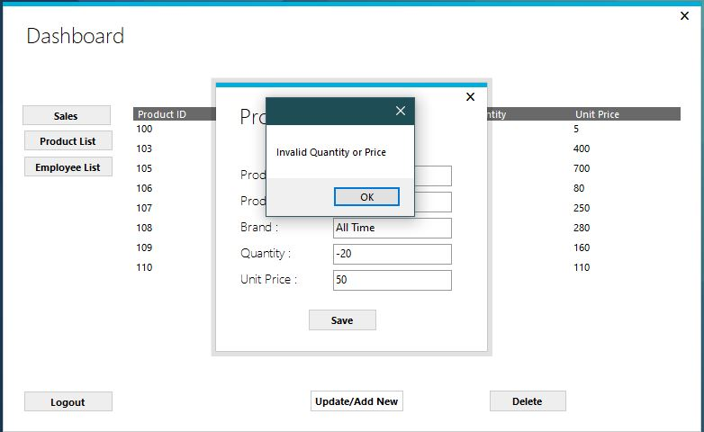
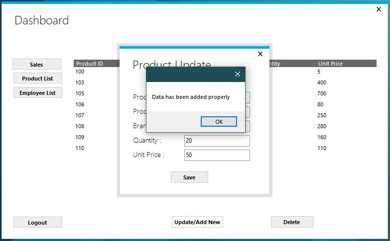
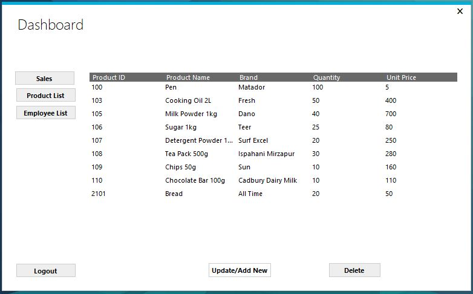
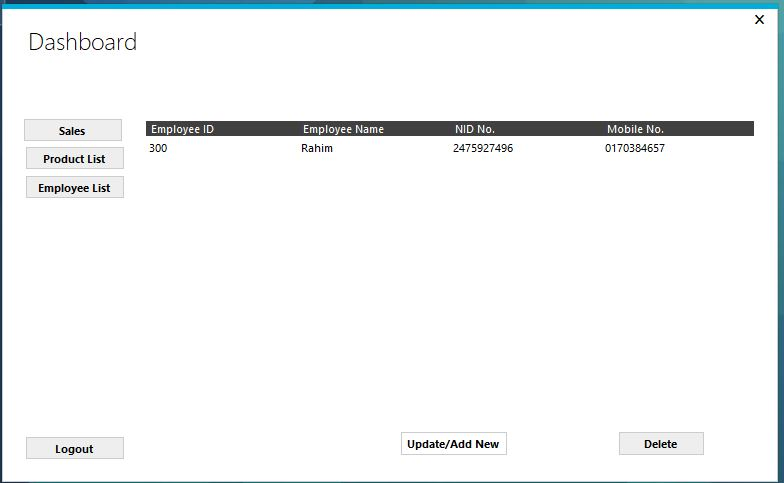

# Super Shop Management System

A desktop-based super shop management application developed using **C# Windows Forms** and **Microsoft SQL Server**.

## ✨ Features

- User login and authentication
- Product management
- Employee management
- Sales record management
- Search sales records by date
- CRUD operations for products and employees
- SQL Server database integration

## 🛠️ Technologies Used

- C#
- Windows Forms
- Microsoft SQL Server
- SQL Server Management Studio (SSMS)
- Visual Studio

## 🗄️ Database Design

The application uses three main entities:

- **Products**
- **Sales**
- **Employee**

### ER Diagram

## 👨‍💻 Implementation

- Designed the Entity-Relationship (ER) diagram.
- Designed and created the database tables using SQL Server Management Studio (SSMS).
- Implemented the login and authentication functionality.
- Developed the Product List module with CRUD operations.
- Developed the Employee List module with CRUD operations.
- Developed the Sales records interface.
- Implemented date-based search for sales records.
- Integrated the Windows Forms application with Microsoft SQL Server.
- Implemented dashboard navigation between the application modules.

## 📸 Screenshots

### Application Screens

## 📚 Academic Context

This project was developed as part of the **Object-Oriented Programming 2** course at **American International University-Bangladesh (AIUB)**.

## 👨‍💻 Author

**Md. Zunaed Rahman**

GitHub: [itszunaed](https://github.com/itszunaed)
